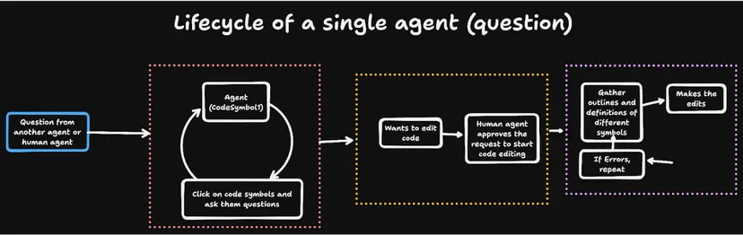
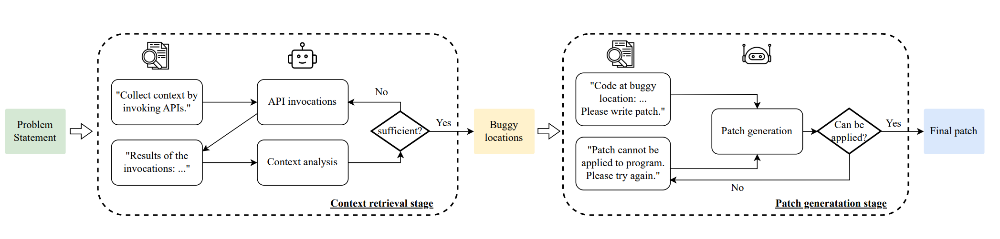

# Table of Contents
1. [Aide + Mixed Models](#aide--mixed-models)  
   1.1 [Execution-procedure](#execution-procedure)  
   1,2 [Highlight](#highlight)  
   1.3 [Trick](#trick)  
   1.4 [Performance](#performance)  
   1.5 [Insight](#insight)   
   &ensp; 1.5.1 [Agent](#agent)  
   &ensp; 1.5.2 [Model](#model)    
   &ensp; 1.5.3 [Task](#task)  
   1.6 [Future Works](#future-works)
2. [Factory Code Droid](#factory-code-droid)
3. [AutoCodeRover (open source)](#autocoderover-open-source)
4. [Alibaba lingma(通义灵码)](#alibaba-lingma)
5. [Agentless (open source)](#agentless-open-source)
6. [Aider (open source)](#aider-open-source)


# Aide + Mixed Models
> Only on Leaderboard (Lite)  
> Relied on Sonnet3.5 and GPT-4o together to reach the score.
> eval logs and patches in [here](https://github.com/codestoryai/swe_bench_traces/tree/main)

rank1 in the swe-bench lite  
an AI-powered mod of VSCode


## Execution-procedure



## Highlight
- multi-agent framework
- Code symbols as identity for agents  
[detail about code symbol](https://aide.dev/blog/towards-an-agentic-future-in-the-editor)
> A class or a function in python is an example of a code symbol which a single agent will be responsible for, avoiding conflict of work between agents
- human in loop when edit
> Anytime an agent wants to edit, they ask the user or another agent for approval and present the reason.  
> After been approved, gather context about other code symbols then make editing.  
> Run tests after each edit, providing feedback and doing error correction.  
> Use Pyright (a static code checker for python) to grab missing imports or details which the agent might have missed.   
- find the golden files (key files) by using Repo Map / Keyword search / Go-to-definition / Go-to-reference (can find golden files in 78% cases)
- ping-pong style communication
> The agent swarm does not have a core planning stage, each agent (every agent is responsible for a code-symbol) to ping other agents and gather information, where information is exchanged and propagated.

## Trick
- rewrite entire functions/class, rather than search/replace block-based edits
- Prompt Engineering. [code](https://github.com/codestoryai/prompts/tree/main/llm_prompts/src)
- LSP: Language Server Protocol. The protocol between language server (understanding the grammar and definition of specific programming language) and editor (eg: vscode) 
- [tree-sitter](https://tree-sitter.github.io/tree-sitter/): a parser generator tool and an incremental parsing library. It can build a concrete syntax tree (CST, more concrete than AST) for a source file and efficiently update the syntax tree as the source file is edited


## Performance
The agent swarm takes around 5 minutes on average to complete tasks.  
For harder questions, it took close to 15 minutes with a majority spent on context gathering, not code editing.

## Insight

### Agent
- More time and compute to explore problem space, the better the outcome is  
- There is institutional knowledge in these codebases which the agent is **unable** to grasp and work with. Institutional knowledge typically includes rules, techniques, and processes that can only be understood through long-term work and experience accumulation within an organization.
- Test plan is important. Some code changes can blow up in the test environment if the agent did not come up with a good enough test plan.


### Model
- For code exploration: Claude 3.5 Sonnet is more suitable
> Would know how to reason with a base class if the current class extends it.  
> Stay on track with follow-ups if the function signature changes.
- For code editing, GPT-4o is preferred over Sonnet 3.5 around 65% of the times.
> GPT-4o’s edits had less code complexity  
> GPT-4o also showed superior library knowledge and would often, unprompted, remember a random fact about the library which could be used to solve the problem  
> In terms of pure algorithm-driven code editing, GPT-4o is better than Sonnet 3.5
- New models would know about all of these issues we are trying to solve  
Even after this fact, no framework is at 100% success rate yet, this still shows the gap in making an agent driven framework work perfectly.

### Task

> There are a set of impossible questions which cannot be solved by any framework or human.   
> These involve questions where the error needs to be formatted exactly as the test.   


## Future works
- Let user and agent edit code at the same time in a file
- Support user lead these agents towards the right path if its direction is incorrect
- Support for other programming language (not only Python)

# Factory Code Droid

rank1 in the swe-bench full  
A Industry grade streamline for software development  


[home](https://www.factory.ai/)

[Technical Report](https://www.factory.ai/news/code-droid-technical-report)  


# AutoCodeRover (open source)
rank2 in the swe-bench full, rank5 in the swe-bench lite  

Github: [nus-apr/auto-code-rover](https://github.com/nus-apr/auto-code-rover/?tab=readme-ov-file)  

blos: [blogs](https://autocoderover.dev/publications.html)

paper: [AutoCodeRover: Autonomous Program Improvement](https://arxiv.org/abs/2404.05427)


## workflow  




# Alibaba lingma
> only on Leaderboard (Lite)


paper: [How to Understand Whole Software Repository?](https://arxiv.org/abs/2406.01422)

workflow: [img](./imgs/workflow.png)  

1. Repository Knowledge Graph: RepoUnderstander first condenses critical repository information into a repository knowledge graph. This graph represents the hierarchical structure of the repository, reducing the complexity and making the vast amounts of data more manageable.

2. Monte Carlo Tree Search (MCTS)-Based Exploration: The paper leverages a Monte Carlo tree search strategy to explore repositories. This method enhances the agents' ability to navigate and understand the repository by systematically exploring possible paths and decision points based on the repository's structure.

3. Summarization, Analysis, and Planning: Agents are guided to summarize, analyze, and plan their interactions with the repository. This structured approach allows them to dynamically acquire relevant information and apply it effectively.

4. Patch Generation and Issue Resolution: Utilizing the insights gained from the repository knowledge graph and MCTS exploration, RepoUnderstander enables agents to generate patches and solve real-world GitHub issues, demonstrating practical applications of the technology.


# Agentless (open source)

Github: [OpenAutoCoder/Agentless](https://github.com/OpenAutoCoder/Agentless)

Paper: [Agentless: Demystifying LLM-based Software Engineering Agents](https://arxiv.org/abs/2407.01489)

Localization & Repairing.  
Localization is the same as aider.  
repairing:  

generate multiple diff patch, then reranking & voting.  


# Aider (open source)

[aider-swe-bench](https://github.com/paul-gauthier/aider-swe-bench)


## Localization

using **repository map, not RAG** to help the LLM understand the code structure.  

1. The repo map is created through static analysis of the code’s AST and call graph to provide a summary of the code base
2. The map is constantly tailored to show repo context that is relevant to the current state of the chat conversation. This is done by performing a **graph optimization** on the code’s call graph.

### repo map introduction
repo map:  
```shell
aider/coders/base_coder.py:
⋮...
│class Coder:
│    abs_fnames = None
⋮...
│    @classmethod
│    def create(
│        self,
│        main_model,
│        edit_format,
│        io,
│        skip_model_availabily_check=False,
│        **kwargs,
⋮...
│    def abs_root_path(self, path):
⋮...
│    def run(self, with_message=None):
⋮...

aider/commands.py:
⋮...
│class Commands:
│    voice = None
│
⋮...
│    def get_commands(self):
⋮...
│    def get_command_completions(self, cmd_name, partial):
⋮...
│    def run(self, inp):
⋮...

```

It only provides some key information:
- GPT can see classes, methods and function signatures from everywhere in the repo.
- If it needs to see more code, LLM can use the map to figure out which files it needs to look at in detail. LLM will then ask to see these specific files, and aider will automatically add them to the chat context.
- It only includes the most important identifiers which are most referenced by other code. It doesn’t contain every class, method and function from those files


### repo map making
aider uses tree sitter to build the map.  
It specifically uses the [py-tree-sitter-languages](https://github.com/grantjenks/py-tree-sitter-languages) python module, (A python binding for tree-sitter)

Tree-sitter parses source code into an AST. Using the AST, aider identify where functions, classes, variables, types and other definitions, references occur in the source code.   
Aider uses all of these definitions and references to determine which are the most important identifiers in the repository, and to produce the repo map that shows just those key lines from the codebase.


### repo-map optimizing repo-map rank
Sending just the most **relevant** portions of the repo map to LLM. (using graph-ranking algorithm in networkx package)

1. Graph Construction:  
A directed graph is created where each node represents a source file within the repository.  
Edges between nodes are defined based on references and definitions between files and symbols within those files.  

2. Node Weighting:  
Personalization values are assigned to each node based on whether a file is currently in chat or mentioned more frequently, thereby increasing its importance in the ranking process.

3. Edge Definition:  
Edges are weighted based on the number of references and the type of reference (definition or usage).   

4. PageRank Calculation:  

This algorithm helps in determining the importance of each file based on the structure of the graph.
Adjustments are made to distribute the rank from each node across all its outgoing edges proportionally to their weight.  

5. Result Compilation:  

The final ranking of each node (file) is used to prioritize which files and symbols are most relevant.  
Files are then included in the repo map based on their ranked importance, ensuring that the most contextually significant files are presented first.


## Editing
Repository map making sure that the LLM can see relevant classes, functions and variables from the entire repo

## Linting and fixing, then find a plausible solution


tree-slitter for linting, ensure the code has no syntax or other fatal errors. introduction for [Tree-sitter](https://juejin.cn/post/7120884566511845389)

find plausible solution (might be not efficiency):   
A plausible solution is one where linter saying that it edited the repo with no outstanding edit, lint, or test errors.   
In this case, aider’s changes are recorded as the SWE Bench `model_patch` to be evaluated later with the acceptance tests.  

If the solution is not plausible, **another instance of aider is launched again from scratch on the same problem**. The harness alternates launching aider with GPT-4o and Opus to solve the problem, and gives each model three attempts – for a total of six attempts.  
If all six attempts fail to produce a plausible solution, then the “best” solution available is selected as the model_patch. Which of the non-plausible solutions to use is determined by ignoring the testing outcome and prioritizing solutions in the following order:  

Pick a solution where editing and linting were completed successfully.  
Pick a solution where editing was at least partially successful and linting succeeded.  
Pick a solution where editing was successful.  
Pick a solution where editing was at least partially successful.  

## Insight

### Model
Code editing leaderboard and code refactory leaderboard: https://aider.chat/docs/leaderboards/  

I will use DeepSeek Coder V2 (whole) to edit code, use claude-3-opus to refactor code through this leaderboard.  


# DevOps For SWEBench-lite

[SWE-bench-docker](https://github.com/aorwall/SWE-bench-docker)  

mini hands on project: [aorwall/moatless-tools](https://github.com/aorwall/moatless-tools/tree/main)


# The feature we must support

- tree-litter, using to construct repo map, find the definitions and references, check the syntax error
- page rank algorithm  
- repo map like structure  
- 


