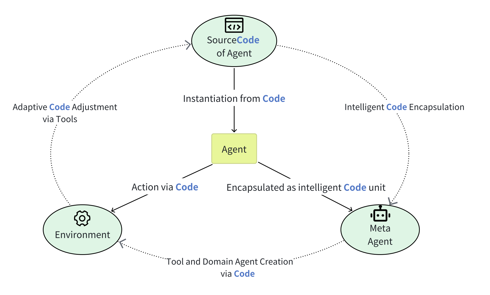

# GhostOS

> The AI `Ghosts` wonder in the `Shells`.

* [中文文档](/zh-cn/README.md)
* [Documents](/en/README.md)
* [Discord Server](https://discord.gg/NG6VKwd5jV)

## Example

使用 Python 代码 [SpheroBoltGPT](https://github.com/ghost-in-moss/GhostOS/tree/main/libs/ghostos/ghostos/demo/sphero/bolt_gpt.py),
定义了一个以 [SpheroBolt](https://sphero.com/products/sphero-bolt) 玩具为躯体的智能机器人.

如果你有 SpheroBolt, 运行 `ghostos web ghostos.demo.sphero.bolt_gpt` 可以启动这个机器人:


Demo 中初步实现的功能:

1. 实时语音对话.
2. 控制身体运动, 控制 8*8 led matrix 绘画图形.
3. 通过自然语言对话, 学习包含动作和动画的技能.
4. 在对话中通过动作表达情绪.

## Introduce

`GhostOS` 是一个 AI Agent 框架, 旨在用图灵完备的代码交互界面 ([Moss Protocol](/zh-cn/concepts/moss_protocol.md)) 取代
JSON Schema,
成为 LLM 和 Agent 系统能力交互的核心方式.
详见: [MOSS: Enabling Code-Driven Evolution and Context Management for AI Agents](https://arxiv.org/abs/2409.16120)

预期通过代码调用的对象包括`工具`, `人格`, `智能体集群`, `工作流`, `思维`, `规划`, `知识` 和 `记忆`.
从而使一个 Meta-Agent 能用代码生成和项目管理的方式, 变成一个可以持续学习成长的智能体.

而这样用代码仓库实现的智能体, 又能以仓库的形式分享和安装.

`GhostOS` 还在早期验证的阶段, 当前版本主要实现开箱即用的能力, 包括:

- [x] 将各种 python 脚本直接变成对话 Agent
- [x] Agent 拥有基于 [Streamlit Web](https://streamlit.io/) 实现的界面.
- [x] 支持 `OpenAI`, `Moonshot` 等模型
- [x] 支持 OpenAI 的视觉能力 ([OpenAI vision](https://platform.openai.com/docs/guides/vision))
- [x] 支持 OpenAI 实时语音对话 ([OpenAI Realtime Beta](https://platform.openai.com/docs/guides/realtime))

## Quick Start

> `GhostOS` 仍然是一个验证中的 AI 项目, 强烈建议安装到 docker 之类的容器中, 而不在本地执行.

安装 `GhostOS`:

```bash
pip install ghostos
```

初始化 `workspace` (默认 `app`), 当前版本的运行时文件都会存入目录.

```bash
ghostos init
```

配置大模型. 默认使用 OpenAI `gpt-4o`, 要求环境变量存在 `OPENAI_API_KEY`.

```bash
export OPENAI_API_KEY="your openai api key"
# Optionals: 
export OPENAI_PROXY="sock5://localhost:[your-port]" # setup openai proxy
export DEEPSEEK_API_KEY="your deepseek api key"
epoxrt MOONSHOT_API_KEY="your moonshot api key"
```

或者运行 `streamlit` 打开配置界面:

```bash
ghostos config
```

测试运行自带的 agent:

```bash
# run an agent with python filename or modulename
ghostos web ghostos.demo.agents.jojo
```

或者将本地的 Python 文件变成一个 Agent, 可以通过自然语言对话要求它调用文件中的函数或方法:

```bash
ghostos web [my_path_file_path]
```

当前的测试用例:

```bash
ghostos web ghostos.demo.agents.jojo
ghostos web ghostos.demo.test_agents.moonshot         # moonshot-v1-32k model
ghostos web ghostos.demo.test_agents.deepseek_chat    # deepseek chat model
ghostos web ghostos.demo.test_agents.openai_o1_mini   # openai o1 mini model
```

可以通过创建本地 python 文件, 定义出自己的 Agents. 详情请见:

* [Chatbot](/zh-cn/usages/chatbot.md): 极简的对话机器人
* [MossAgent](/zh-cn/usages/moss_agent.md): 能使用 python 的 agent

## Install Realtime

`GhostOS` 当前支持 [OpenAI Realtime](https://platform.openai.com/docs/guides/realtime),
使用 [pyaudio](https://pypi.org/project/PyAudio/) 来处理实时语音的输入输出.
需要安装相关依赖: 

```bash
pip install 'ghostos[realtime]'
```

> 在安装 pyaudio 的时候可能会遇到一些问题, 我相信 gpt-4o, google 和 stackoverflow 能够很好地帮助你解决它们. 

## Use In Python

```python
from ghostos.bootstrap import make_app_container, get_ghostos
from ghostos.ghosts.chatbot import Chatbot

# create your own root ioc container.
# register or replace the dependencies by IoC service providers.
container = make_app_container(...)

# fetch the GhostOS instance.
ghostos = get_ghostos(container)

# Create a shell instance, which managing sessions that keep AI Ghost inside it.
# and initialize the shell level dependency providers.
shell = ghostos.create_shell("your robot shell")
# Shell can handle parallel ghosts running, and communicate them through an EventBus.
# So the Multi-Agent swarm in GhostOS is asynchronous.
shell.background_run()  # Optional

# need an instance implements `ghostos.abcd.Ghost` interface.
my_chatbot: Chatbot = ...

# use Shell to create a synchronous conversation channel with the Ghost.
conversation = shell.sync(my_chatbot)

# use the conversation channel to talk
event, receiver = conversation.talk("hello?")
with receiver:
    for chunk in receiver.recv():
        print(chunk.content)
```

## Developing Features

* [ ] 开箱即用的 Agent 能力类库.
* [ ] 变量类型消息与 Streamlit 渲染.
* [ ] 异步的 Multi-Agent.
* [ ] 长程任务规划与执行.
* [ ] 原子化的思维能力.
* [ ] 树形项目的自动执行与管理.
* [ ] 框架可配置化的组件.
* [ ] 玩具级具身智能的实验.

> `GhostOS` 作为一个个人项目, 目前没有精力用于完善文档, 存储模块, 稳定性或安全性等问题.
>
> 项目的迭代将长时间聚焦于验证 `代码驱动的具身智能体`, `代码驱动的思维能力`, `代码驱动的学习与成长` 三个方向.
> 并完善开箱即用的 agent 相关能力.

# So What is GhostOS?

`GhostOS` 这个项目是作者用来做 AI 应用探索而开发的. 基本思路如下:

AI Agent 技术有两条并行的演进路径, 一种是模型自身能力的完善, 一种则是 Agent 工程框架的进化.
Agent 框架的生产力水平, 决定了 AI 模型在应用场景落地的可行性.

`GhostOS` 把 Agent 的能力从代码反射成 Prompt, 提供给大模型, 大模型生成的代码直接在环境中运行.
通过一个图灵完备的编程语言界面, 大模型可以解决包括计算, 调用工具, 身体控制, 人格切换, 思维范式, 状态调度, Multi-Agent,
记忆与召回等一切动作.

这会比基于 json schema 等方式的交互能力更强, 开销更小.
在这过程中生成的交互数据, 又可以用于模型的 post-training 或强化学习, 从而不断优化效果.

AI Agent 本身也是使用代码实现的. 所以大模型驱动的 Meta-Agent 实现其它的 Agent, 可以还原为一个编程问题.
理想情况下, 大模型驱动的 Meta-Agent 可以通过编写代码, 编写自己的工具, 用数据结构定义的记忆和思维链, 乃至于生成其它的
Agent.



进一步, 大多数有严谨步骤的复杂任务, 都可以用树或者图的数据结构描述.
用 json 之类的方式构建一个结构嵌套的图或者树非常困难, 而用编程语言是最高效的.
大模型可以把对话学习到的成果沉淀成代码中的节点, 再将它们规划成树或者图, 从而执行足够复杂的任务.

这样, AI Agent 可以把自然语言教学习得的知识和能力, 以文件和代码的形式存储, 从而自我进化. 这是模型迭代之外的进化之路.

基于以上思路, `GhostOS` 希望把 Agent 集群变成一个通过代码构建出来的项目. Agent 又不断把新的知识和能力用代码形式沉淀,
丰富这个项目.
最终 Agent 项目可以用仓库的形式复制, 分享或部署. 形成一种可基于代码自我进化, 持续学习的智能体集群.
在这种新生产力形态中, 用纯代码交互是最关键的一步.

作者最大的目标不是 `GhostOS` 本身, 而是验证和推动这种代码交互的设计与应用. 希望有一天行业里的 Agent, 思维范式, 躯体和工具,
都可以基于相同的编程语言协议设计, 实现跨项目通用.

