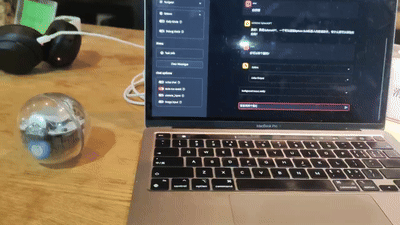

# GhostOS

`GhostOS` 是一个开发中的 AI Agent 框架. 它的目标是除了自然语言之外, 用 `代码` 作为大模型与外部系统交互的核心方式. 它的基本思路如下:

把 Agent 的能力用代码 API 的方式提供给大模型, 大模型生成的代码直接在环境中运行.
通过一个图灵完备的编程语言界面, 大模型可以解决包括计算, 调用工具, 身体控制, 人格切换, 思维范式, 状态调度, Multi-Agent, 记忆与召回等一切动作.

这会比基于 json schema 等方式的交互能力更强, 开销更小. 
在这过程中生成的交互数据, 又可以用于模型的 post-training 或强化学习, 从而不断优化效果.

AI Agent 本身也是使用代码实现的. 所以大模型驱动的 Meta-Agent 实现其它的 Agent, 可以还原为一个编程问题. 
理想情况下, 大模型驱动的 Meta-Agent 可以通过编写代码, 编写自己的工具, 用数据结构定义的记忆和思维链, 乃至于生成其它的 Agent.

进一步, 大多数有严谨步骤的复杂任务, 都可以用树或者图的数据结构描述.
用 json 之类的方式构建一个结构嵌套的图或者树非常困难, 而用编程语言是最高效的.
大模型可以把对话学习到的成果沉淀成代码中的节点, 再将它们规划成树或者图, 从而执行足够复杂的任务.

基于以上思路, `GhostOS` 希望把 Agent 集群变成一个通过代码构建出来的项目. Agent 又不断把新的知识和能力用代码形式沉淀, 丰富这个项目.
最终 Agent 项目可以用仓库的形式复制, 分享或部署. 形成一种可基于代码自我进化, 持续学习的智能体集群.
在这种新生产力形态中, 用纯代码交互是最关键的一步.

作者最大的目标不是 `GhostOS` 本身, 而是验证和推动这种代码交互的设计与应用. 希望有一天行业里的 Agent, 思维范式, 躯体和工具, 
都可以基于相同的编程语言协议设计, 实现跨项目通用. 

相关论文: 
- [MOSS: Enabling Code-Driven Evolution and Context Management for AI Agents](https://arxiv.org/abs/2409.16120)

> 由于 `GhostOS` 仍是一个个人项目, 最大的目的是验证上述技术思路的可行性.
> 精力有限的情况下, 无法完善所有的技术细节和文档.
> 所以相当长一段时间内, GhostOS 会专注于开发开箱即用的能力, 而无法完善框架的文档和社区建设.

# Examples

## SpheroBoltGPT

[SpheroBoltGPT](https://github.com/ghost-in-moss/GhostOS/examples/sphero/sphero_bolt_gpt_agent.py) 使用 60 行代码,
将一个 SpheroBolt 玩具变成一个可以自然语言交互的机器人. 

独立项目地址 (todo)

## Talk to Python

将一个 python 脚本直接变成 Agent, 让大模型控制脚本调用任何函数. 

# QuickStart
