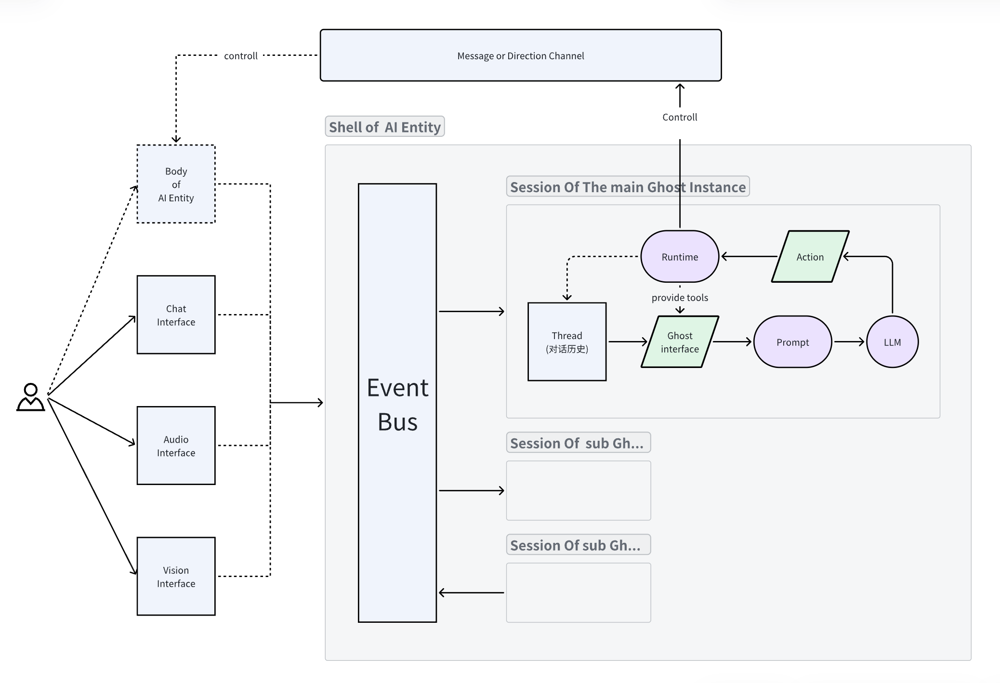

# Abstract Classes Design

`GhostOS` 的抽象设计遵循了 `面向接口编程` 这一原则. 
所有模块使用了抽象类来设计, 通过 [IoC Container](../concepts/ioc_container.md) 来组装实现. 



这些抽象基本的相互关系, 和使用逻辑如下: 

```python
from ghostos.abcd import GhostOS, Shell, Conversation, Ghost
from ghostos.container import Container
from ghostos.bootstrap import make_app_container, get_ghostos

# create your own root ioc container.
# register or replace the dependencies by IoC service providers.
container: Container = make_app_container(...)

# fetch the GhostOS instance.
ghostos: GhostOS = get_ghostos(container)

# Create a shell instance, which managing sessions that keep AI Ghost inside it.
# and initialize the shell level dependency providers.
shell: Shell = ghostos.create_shell("your robot shell")
# Shell can handle parallel ghosts running, and communicate them through an EventBus.
# So the Multi-Agent swarm in GhostOS is asynchronous.
shell.background_run()  # Optional

# need an instance implements `ghostos.abcd.Ghost` interface.
my_chatbot: Ghost = ...

# use Shell to create a synchronous conversation channel with the Ghost.
conversation: Conversation = shell.sync(my_chatbot)

# use the conversation channel to talk
event, receiver = conversation.talk("hello?")
with receiver:
    for chunk in receiver.recv():
        print(chunk.content)

```


详细内容请直接看代码 [ghostos.abcd.concepts](https://github.com/ghost-in-moss/GhostOS/ghostos/abcd/concepts.py)

> 抽象设计的相关介绍非常繁杂, 有精力再完成文档. 