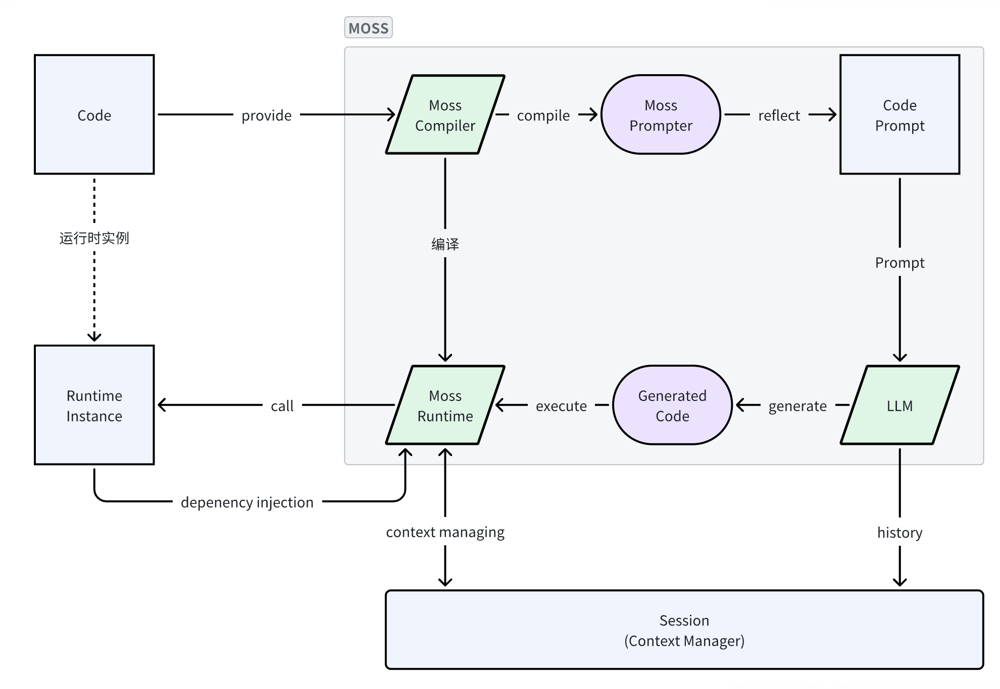

# MOSS Protocol

当前主流 AI Agent 的框架使用 `JSON Schema Function Call` 为代表的手段来操作系统提供的能力.
也有越来越多的框架开始直接用模型生成的代码来驱动, 代表性的是 OpenInterpreter.

`GhostOS` 项目设想, 未来的 AI Agent 与外部系统主要的交互手段是基于代码化的协议, 这包含四个方面:

* `Code As Prompt`: 系统通过一系列的规则, 将代码直接反射成 Prompt 提供给大模型, 让大模型直接调用.
* `Code Interpreter`: 系统将大模型生成的代码直接在环境里执行, 用来驱动系统行为.
* `Runtime Injection`: 系统将运行时生成的各种实例, 注入到上下文中.
* `Context Manager`: 系统管理多轮对话中各种变量的存储, 使用和回收.

这整套方案在 `GhostOS` 里定义为 `MOSS` 协议, 全称是 `Model-oriented Operating System Simulator` (
面向模型的操作系统模拟器).

## MOSS

MOSS 的实现 [ghostos.core.moss](https://github.com/ghost-in-moss/GhostOS/tree/main/ghostos/core/moss) 
是一个可以脱离 `GhostOS` 项目使用的 python 模块.

### Purpose

`MOSS` 的设计目标, 是让人类工程师和大模型一样, 所见即所得地阅读一个代码上下文. 
我们以 `SpheroBoltGPT` (用代码驱动玩具 SpheroBolt) 为例: 

```python
from ghostos.prototypes.spherogpt.bolt import (
    RollFunc,
    Ball,
    Move,
    LedMatrix,
    Animation,
)
from ghostos.core.moss import Moss as Parent


class Moss(Parent):
    body: Ball
    """your sphero ball body"""

    face: LedMatrix
    """you 8*8 led matrix face"""


```
这段代码就定义出了一个用来控制 Sphero Bolt 的 python 上下文. 

大模型和人类工程师阅读这份代码, 看到可以通过 `moss.body` 或 `moss.face` 驱动 SpheroBolt 的行为. 
代码中被引用的 `RollFunc`, `Ball`, `Move` 等类库, 会自动反射成 Prompt, 和源码一起提交给 LLM, 用来生成控制代码. 

这样可以要求 LLM 生成一个函数: 

```python
def run(moss: Moss):
    # body spin 360 degree in 1 second.
    moss.body.new_move(True).spin(360, 1)
```

`MossRuntime` 会将这个函数编译到当前模块, 然后运行其中的 `run` 函数. 当这个代码执行时, 就真实调用了 SpheroBoltGPT 的 `body` 对象.

### Abstract Classes

`MOSS` 实现的核心是三个类:

* [MossCompiler](https://github.com/ghost-in-moss/GhostOS/tree/main/ghostos/core/moss/abcd.py): 编译任何 python module, 生成一个可供解析的临时模块.
* [MossPrompter](https://github.com/ghost-in-moss/GhostOS/tree/main/ghostos/core/moss/abcd.py): 反射 python module, 用来生成大模型看到的 Prompt.
* [MossRuntime](https://github.com/ghost-in-moss/GhostOS/tree/main/ghostos/core/moss/abcd.py): 在编译的临时 module 中, 执行大模型生成的代码.



### Get MossCompiler

`MossCompiler` 注册到了 [IoC Container](/zh-cn/concepts/ioc_container.md) 中. 要获取它的实例可以:

```python
from ghostos.bootstrap import get_container
from ghostos.core.moss import MossCompiler

compiler = get_container().force_fetch(MossCompiler)
```

### PyContext

`MossCompiler` 使用 [PyContext](https://github.com/ghost-in-moss/GhostOS/tree/main/ghostos/core/moss/pycontext.py) 数据结构来管理一个可持久化的上下文.
它可以用来存储运行时定义, 修改过的变量; 也可以管理对 python 代码的直接修改, 用于下一次运行.

每个 `MossCompiler` 都会继承一个独立的 IoC Container, 因此可以使用它进行依赖注入的注册:

```python
from ghostos.core.moss import MossCompiler
from ghostos_container import Provider

compiler: MossCompiler = ...


class Foo:
    ...


f: Foo = ...

some_provider: Provider = ...

compiler.bind(Foo, f)  # 绑定到 compiler.container()
compiler.register(some_provider)  # 注册 provider 到 compiler.container()

attr_value = ...

compiler.with_locals(attr_name=attr_value)  # 在目标 python module 注入一个本地变量 attr_name 
```

### Compile Runtime

使用 `MossCompiler` 可以基于 PyContext 或 python modulename 来编译一个临时的 module.

```python
from ghostos.bootstrap import get_container
from ghostos.core.moss import MossCompiler, PyContext

pycontext_instance: PyContext = ...
compiler = get_container().force_fetch(MossCompiler)

# join python context to the compiler
compiler.join_context(pycontext_instance)

runtime = compiler.compile(None)
```

### Get Compiled Module

可以从 MossRuntime 中获取被编译的临时模块:

```python
from types import ModuleType
from ghostos.core.moss import MossRuntime

runtime: MossRuntime = ...

module: ModuleType = runtime.module()
```

### Moss Prompter

使用 `MossRuntime` 可以得到一个 `MossPrompter`, 用来生成大模型的 Prompt:

```python
from ghostos.core.moss import MossRuntime

runtime: MossRuntime = ...

with runtime:
   prompter = runtime.prompter()
   prompt = prompter.dump_module_prompt()  # 获取模块完整的 Prompt

   # prompt 由以下部分构成: 

   # 1. 编译模块的源码
   code = prompter.get_source_code()  # 获取模块的源码

   for attr_name, attr_prompt in prompter.imported_attr_prompts():
      # 获取编译模块中, 各个属性的 prompt. 默认情况只会反射从其它模块 import 的属性. 
      print(attr_name, attr_prompt)

      # 2. 被引用的变量反射出来的 prompt. 
   attr_prompt = prompter.dump_imported_prompt() 
```

#### Hide Code to LLM

被 `MossCompiler` 编译的 module 其源码会全部提供给大模型. 如果想要隐藏一部分代码的话, 可以通过 `# <moss-hide>` 标记:

```python

# <moss-hide>
from typing import TYPE_CHECKING

if TYPE_CHECKING:
   from ghostos.core.moss import MossPrompter


# 这里定义的代码会正常执行, 但不会提交给 LLM
# 这些代码通常用来定义 MossCompiler/Runtime 运行生命周期里的逻辑
# 大模型不需要知道这些逻辑, 屏蔽它们有利于大模型更专注. 

def __moss_module_prompt__(prompter: "MossPrompter") -> str:
   ...

# </moss-hide>
```

#### Code Reflection

我们使用反射机制将代码的讯息自动生成 Prompt, 并提供给大模型.
基本思路与程序员看引用库的心态一样, 只让 LLM 看到它关心的最少量讯息, 主要是类与函数的定义以及关键的变量.
而不是直接把所有源码提供给模型.

#### Default Reflection Pattern

`MossRuntime` 会反射当前 Python module 里 import 进来的变量, 按一定规则生成它们的 Prompt.
当前规则如下:

* Function & Method: 只反射 函数名 + doc
* Abstract class: 反射源码
* pydantic.BaseModel: 反射源码

此外, 任何一个类如果实现了 `ghostos.prompter.PromptAbleClass`, 会使用它的 `__class_prompt__` 方法生成反射结果.

#### Custom Attr Prompt

如果目标 python module 文件中定义了魔术方法 `__moss_attr_prompts__`, 会使用它提供的结果覆盖掉自动反射的结果.

```python
def __moss_attr_prompts__() -> "AttrPrompts":
    yield "key", "prompt"
```

如果返回的 Prompt 为空, 则不会对大模型展示.

### Runtime Execution

基于 `MossRuntime`, 可以将大模型生成代码直接在编译出来的临时 Module 里执行. 这么做的好处是:

1. LLM 不需要 import 所有的类库, 节省 tokens 的开销
2. 加快生成的速度, 期望许多时候超过 json schema 的输出.
3. 避免大模型生成代码对上下文模块的污染.
4. 相比 Jupyter 或沙盒执行代码, 临时编译 module 是想获得一个 "最小上下文单元".

基本原理就是使用当前模块作为上下文, 编译执行大模型生成的代码. 内部逻辑如下:

```python
import ghostos.core.moss

runtime: ghostos.core.moss.MossRuntime = ...
pycontext = runtime.dump_pycontext()
local_values = runtime.locals()

generated_code: str = ...

filename = pycontext.module if pycontext.module is not None else "<MOSS>"
compiled = compile(generated_code, filename=filename, mode='exec')
# 直接编译
exec(compiled, local_values)
```

我们可以要求大模型生成的代码是一个 `main` 函数, 我们用 `MossRuntime` 编译完代码后可以立刻执行这个函数:

```python
import ghostos.core.moss

runtime: ghostos.core.moss.MossRuntime = ...
# 包含 main 函数的代码
generated_code: str = ...

with runtime:
    result = runtime.execute(target="main", code=generated_code, local_args=["foo", "bar"])

    # 执行过程中的 std output
    std_output = runtime.dump_std_output()
    # 获取变更过的 pycontext
    pycontext = runtime.dump_pycontext()
```

### Custom Lifecycle functions

`MossRuntime` 在运行的生命周期中, 会尝试寻找编译模块里的魔术方法并执行.
所有的魔术方法都定义在 [ghostos.core.moss.lifecycle](https://github.com/ghost-in-moss/GhostOS/tree/main/ghostos/core/moss/lifecycle.py) 中. 详情请查看文件.
主要有以下几个方法:

```python
__all__ = [
    '__moss_compile__',  # prepare moss compiler, handle dependencies register
    '__moss_compiled__',  # when moss instance is compiled
    '__moss_attr_prompts__',  # generate custom local attr prompt
    '__moss_module_prompt__',  # define module prompt
    '__moss_exec__',  # execute the generated code attach to the module
]
```

### Moss 类

在使用 `MossCompiler` 编译的目标模块中, 可以定义一个名为 `Moss` 的类, 它需要继承自 `ghostos.core.moss.Moss`,
这样它就可以在生命周期中得到关键的依赖注入, 达到所见即所得的效果.

`Moss` 类的作用有两个:
- 自动化依赖注入: 挂载到 Moss 上的抽象类都会获得 IoC 容器的依赖注入. 
- 管理持久上下文: Moss 类上的数据对象会自动存储到 `PyContext`

这个类的存在是默认的, 即便没有定义它, 也会生成一个名为 `moss` 的实例到编译的临时模块中. `moss` 实例可以传递给大模型生成代码里的函数.

比如上下文:

```python
from abc import ABC
from ghostos.core.moss import Moss as Parent

class Foo(ABC):
   ...

class Moss(Parent):
    int_val: int = 0

    foo: Foo  #  the abstract class bound to Moss will automatically get injection from MossRuntime.container()
```

大模型生成的代码:

```python
# 大模型生成的 main 函数
def main(moss) -> int:
    moss.int_var = 123
    return moss.int_var
```

执行这个函数, 未来 `Moss.int_val` 的值就会变成 `123`.

这么做的目的是所见即所得的上下文管理. 主要有以下默认规则:

1. 变量存储: 所有绑定到 `Moss` 实例上的 `pydantic.BaseModel` 和 `int | str | float | bool` 等变量, 会自动存储到
   pycontext.
2. 抽象类依赖注入: 所以在 `Moss` 上挂载的类, 会自动用 IoC Container 尝试注入实例
3. 生命周期管理: 如果一个实现了 `ghostos.core.moss.Injection` 的类, 在注入到 `moss` 实例时,
   会自动调用它的 `on_injection` 与 `on_destroy` 方法.
4. 定义一个 `Moss` 类, 并不会污染破坏目标文件的原有功能.

也可以使用 `MossRuntime` 来获取所有对 `Moss` 类的注入结果:

```python
from ghostos.core.moss import Moss, MossRuntime

runtime: MossRuntime = ...

moss_class = runtime.moss_type()
assert issubclass(moss_class, Moss)

moss_instance = runtime.moss()
assert isinstance(moss_instance, moss_class)

injections = runtime.moss_injections()
```

## Examples

关于 `MOSS` 的基线测试用例在 [ghostos.core.moss.examples](https://github.com/ghost-in-moss/GhostOS/tree/main/ghostos/core/moss/examples)
可以参考其中的测试代码理解它的原理. 

## MOSS TestSuite

所有可以被 `MossCompiler` 编译的源码文件, 这里也称之为 `MOSS 文件`. 

在文件中定义出来的函数, 变量和类是可以单元测试的, 但运行时依赖注入则需要构建测试套件. 

`GhostOS` 提供了一个默认的套件 `ghostos.core.moss.testsuite.MossTextSuite`, 详情请见代码. 


