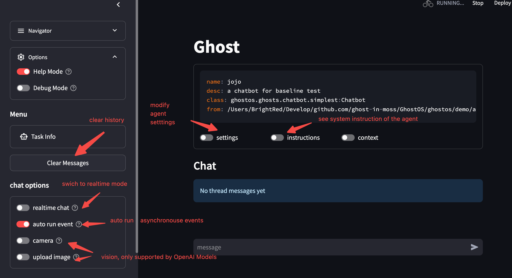

# Chat

## Quick start

`GhostOS` 选择用 [Streamlit](https://streamlit.io/) 提供开箱即用的 Agent.

运行:

```bash
ghostos web python_modulename_or_filename
```

可以将一个 python 文件启动为一个 streamlit 的 agent.

当前版本系统用于测试的 Agent 有:

```bash
# start chatbot
ghostos web ghostos.demo.agents.jojo
```

你可以启动一个可独立运行的 python 文件作为 Agent, 让它解释文件内容, 调用文件的相关方法.
`GhostOS` 会自动反射代码, 生成 Agent 可以看到的上下文.



## Realtime Chat

`GhostOS` 实现了 [OpenAI Realtime Beta](https://platform.openai.com/docs/api-reference/realtime).

对 realtime 模型的配置详见 [configuration](./configuration.md).

> 目前的 realtime 还有很多 bug 和体验问题.
> 毕竟还是个人项目, 将就着用吧...

## Runtime files

当你使用 `GhostOS` 与 agent 对话时, 系统会生成各种运行时文件, 比如:

* thread: 存储历史消息.
* task: 存储对话状态机的状态.
* images and audio: 过程中的图片和音频.
* logs: 运行时日志.

所有这类运行时文件,
都保存在 [\[workspace\]/runtime](https://github.com/ghost-in-moss/GhostOS/tree/main/libs/ghostos/ghostos/app/runtime) 目录.

如果需要清空它们, 请运行:

```bash
ghostos clear-runtime
```

## Create Your Agent

想要创建自己的 agent, 详见 [Usage](/zh-cn/usages/moss_agent)